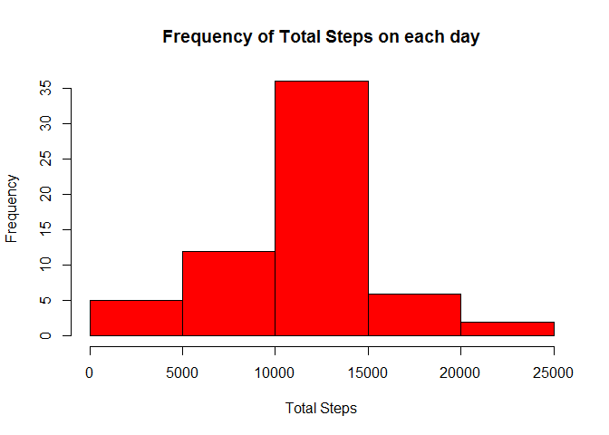

# PA1_template.Rmd
srngit  
Friday, November 12, 2014  

### Loading and Reading the data
First step is to load the data given. Please note that the GitHub repository 
also contains the dataset for the assignment so you do not have to download the 
data separately.

Following code reads the activity data from "activity.csv". No transformation is
done but the data is stored in two stored in two data frames.  

```r
library(dplyr)
```

```r
activity <- read.csv("activity.csv")
initial_act <- activity 
```

### Histogram of total steps and Mean, Median of total steps taken per day   
The following code chunk creates a histogram of the total number of steps,taken
on each day. activity data is summrized by date. 

1. histogram

```r
total_steps <- summarise(group_by(activity,date),sum=sum(steps))
hist(total_steps$sum, main ="Total Steps on each day(Initial Data)",
     xlab ="Total Steps",col="blue")
```

 

2.  mean and median of the total steps per day

```r
ts_mean   <- mean(total_steps$sum,na.rm=TRUE)
ts_median <- median(total_steps$sum,na.rm=TRUE)
```
The mean of total steps taken on a day is: 1.0766189\times 10^{4}
The median of total steps taken on a day is: 10765

### Average daily activity pattern
The following code makes a time series plot of the 5-minute interval (x-axis) 
and the average number of steps taken, averaged across all days (y-axis).

1. Time series 

```r
daily_act <- summarise(group_by(activity,interval),average=mean(steps,na.rm=TRUE))
plot(daily_act$average ~ daily_act$interval, type="l", main = "Steps during Intervals", xlab="Interval", ylab ="Average Daily Steps")
```

 

2. The 5-minute interval with maximum number of steps:

```r
int <- daily_act[which(daily_act$average==max(daily_act$average)),1]
```
The 5-minute interval with maximum number of steps, on an average across all days                         is : 835   

### Imputing missing values

1.  Finding the number of missing values (NAs)

```r
total_NAs <- nrow(activity[activity$steps=="NA",])
```
There are NAs R in the data set are: 2304

### Strategy for filling all the missing values 
2.  Stratety: Replacing the missing [NA]value with the mean for that particular
    interval for entire period. This is achieved by matching of the two data sets
    namesly 'activity' and 'daily_act' by intervals and replacing the NAs in 
    activity with the averages in the daily_act data set.  

### New data set filled 
3.  The following code achieves the objective      

```r
activity$steps[is.na(activity$steps)] <- daily_act$average[match(activity$interval[is.na(activity$steps)],daily_act$interval)]
```

### Histogram, mean and mean of the filled data set
4.  A.  Histogram on filled data

```r
fill_total_steps <- summarise(group_by(activity,date),sum=sum(steps))
hist(fill_total_steps$sum, main ="Frequency of Total Steps on each day", 
     xlab ="Total Steps",col="red")
```

 

4.  B.  Mean and Median of total steps per day

```r
fmean   <- mean(fill_total_steps$sum,na.rm=TRUE)
fmedian <- median(fill_total_steps$sum,na.rm=TRUE)
```
The mean of total steps taken on a day is: 1.0766189\times 10^{4}
The median of total steps taken on a day is: 1.0766189\times 10^{4}
    
## Activity Patterns on Weekdays and Weekends
The activity levels are summarised by weekdays and weekends, using the following code:

```r
library(data.table)
```


```r
newData <- data.table(activity)
newData <- newData[ ,day:= as.factor(weekdays(as.Date(date),abbreviate =TRUE))]
levels(newData$day) <- c("weekday","weekday","weekend","weekend","weekday","weekday","weekday")
week_activity <- summarise(group_by(newData,interval,day),avg_steps =mean(steps))
```

## Panel plot depicting weekday and weekend patterns 

```r
library(lattice)
```

```r
xyplot(avg_steps ~ interval | day, data = week_activity, type="l",layout = c(1, 2), main="Steps for each interval", xlab ="Interval", ylab="Average Steps")
```

 

There are differences in activity patterns during the weekdays and weekends. Activity levels, as reflected by the average steps during a 5-minute interval, are higher for weekdays during the interals 500 (~ 8:30 hrs) and 835 (~ 14:00 hrs).    
